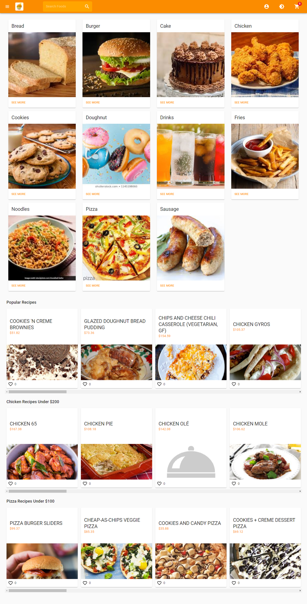

# Kenzy Food Frontend

Kenzy Food is a full‑stack ecommerce experience for browsing menus, building carts, and completing secure checkout flows. This repository contains the React client that powers the product UI and talks to the [Node.js backend](https://github.com/Ekenzy-101/Node-Ecommerce-Backend) over GraphQL APIs.



## Live Demo

- Production: https://kenzyfood.vercel.app/

## Features

- Responsive menu and product catalog with category filters
- Persistent shopping cart with Stripe-powered checkout
- Account creation, authentication, and order history views
- Real-time order status and customer feedback capture
- Admin-ready architecture for managing products and orders

## Tech Stack

- React 18 with modern hooks and context patterns
- Rsbuild for zero-config bundling and dev server
- GraphQL client for type-safe API queries and mutations
- Stripe Elements for payment collection
- Tailwind CSS utility styles (or your preferred CSS framework)

## Prerequisites

- Node.js 18+ and npm (or pnpm/yarn)
- Backend service running from the [Kenzy Food API](https://github.com/Ekenzy-101/Node-Ecommerce-Backend)

## Getting Started

```bash
git clone <repository-url>
cd React-Ecommerce-Website
npm install
npm run dev
```

The dev server starts on `http://localhost:3000` by default. The frontend expects the backend to be reachable; update the environment variables below to point to your API.

## Environment Variables

Create a `.env` file at the project root and add the following keys:

| Variable                      | Description                                  |
| ----------------------------- | -------------------------------------------- |
| `REACT_APP_API_URL`           | GraphQL endpoint for the Kenzy Food backend  |
| `REACT_APP_STRIPE_SECRET_KEY` | Stripe publishable key (e.g., `pk_test_...`) |

Restart the dev server after changing environment variables.

## npm Scripts

- `npm run dev` – launch the Rsbuild development server
- `npm run build` – create a production build in `dist`
- `npm run preview` – serve the production build locally

## Project Structure

- `src/components` – shared UI components such as cards, menus, and layout primitives
- `src/pages` – page-level React routes and data fetching hooks
- `src/lib` – helpers for API clients, utilities, and configuration
- `public/` – static assets including favicons and Stripe verification files

Use these directories as a guide when adding new features.

## Deployment

This frontend deploys seamlessly to Vercel. Configure the environment variables in the Vercel dashboard and point them to the production backend service.

## Contributing

Issues and pull requests are welcome. Please run `npm run build` locally before submitting to ensure the project compiles successfully.

## License

Distributed under the MIT License unless otherwise noted. Refer to the repository license file for details.
